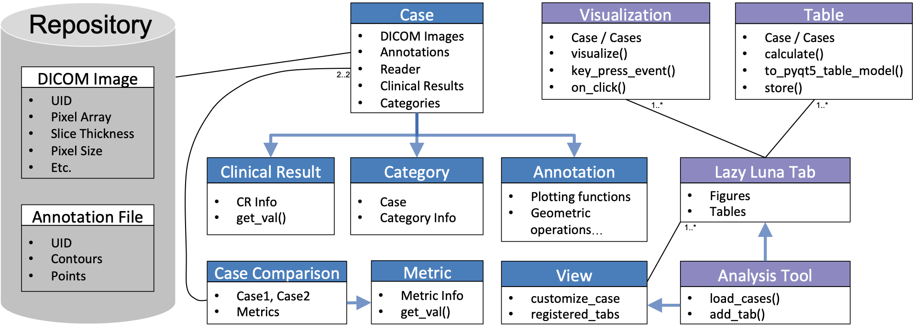

# LazyLuna
Lazy Luna is software for Cardiovascular Magnetic Resonance Imaging (CMR) analysis, which provides a backend for coders and a GUI tool for multilevel reader comparison.

#### Table of Contents  
* [Description](#Description)  
* [Requirements](#Requirements)  
* [Project Overview](#Project-Overview)  
* [First Use](#First-Use)  
* [License](#License)

## Description
Lazy Luna offers a number of base classes for multilevel reader comparison. Multilevel refers to comparisons on the image level (such as contour comparisons), on the patient level (such as differences between assessed clinical parameters) and the reader level (pertaining to statistical trends of reader differences).

#### Requirements
A specific environment for Lazy Luna is recommended. The environment should operate on Python 3.8 or higher with the following libraries installed:
* Pydicom 2.2.0 or higher
* Numpy 1.20.1
* Shapely 1.8.0 or higher
* Rasterio 1.2.10 
* Pandas 1.2.4

The Graphical user interface requires:
* PyQt5 12.11.0
* Matplotlib 3.3.4
* Seaborn 0.11.1

## Project Overview

#### Class Structure
Sequence or use-case specific classes can be inherited from these base classes in order to address specific or novel uses. The classes interact with each other in order to allow for these multilevel comparisons as described in the class diagram below. A more detailed elaboration of the software architecture is documented in [this paper](https://www.nature.com/articles/s41598-022-10464-w).

  

#### Graphical User Interface
Lazy Luna offers a GUI for reader and case comparison. This allows for loading selected cases from two readers, assessing their differences statistically and tracing them to contour origins.

  

## First Use

As described in the paper, a first user experience with Lazy Luna can be realized by comparing a neural network's segmentations of the EMIDEC image dataset to EMIDEC's gold standard contours. The EMIDEC Dataset can be downloaded [here](http://emidec.com/dataset). The annotations for the undertrained neural network are automatically downloaded with Lazy Luna's code in the subfolder /docs. Unzip them into the directory. The nifti image files of EMIDEC can be converted to the Dicom format by running the EMIDEC Notebook in notebooks. 

## License

If the code was helpful to you please cite [my paper](https://www.nature.com/articles/s41598-022-10464-w).